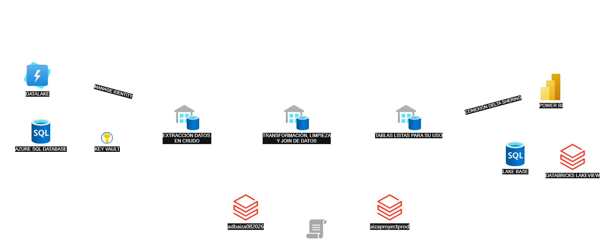
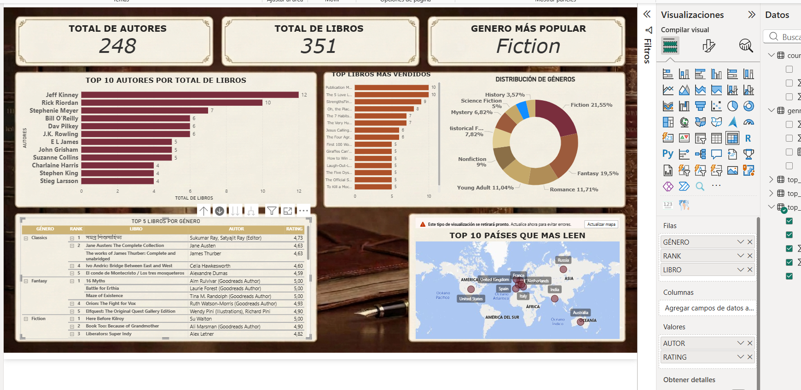
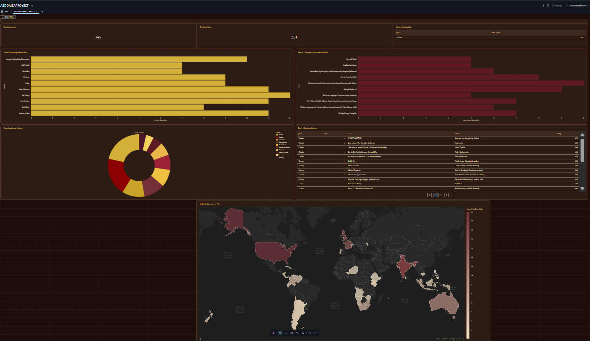
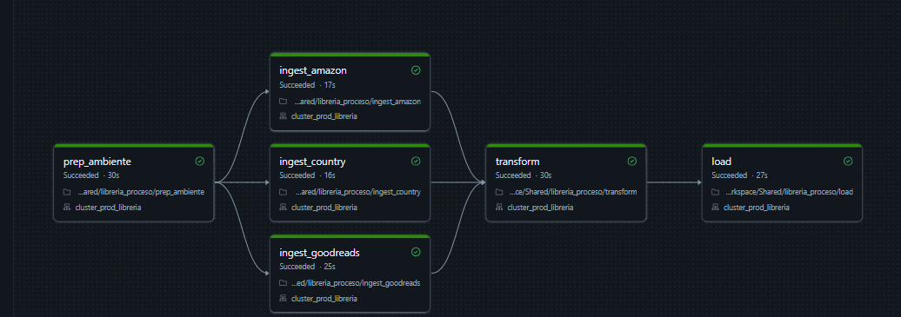

# 📚 Librería Bestsellers — Proyecto de Ingeniería de Datos con Databricks

## 🎯 Contexto de negocio

Este proyecto simula el equipo de datos de una **librería** que necesita responder una pregunta muy concreta:

> ¿Qué libros bestseller (Amazon, 2009-2019) debería incorporar a su catálogo, y cuáles ya tiene?

Para responderla, se cruza el **catálogo propio** de la librería (basado en el dataset Goodreads *Best Books Ever*) con los **bestsellers reales de Amazon**, generando un dashboard que muestra: autores más vendidos, libros más vendidos, distribución de géneros, top 5 libros por género, y el índice de lectura por país (para decidir mercados de expansión).

---

## 🏗️ Arquitectura



Toda la infraestructura vive en **Azure Databricks con Unity Catalog** (`catalog_au`), usando **Managed Identity** (Access Connector) para todas las conexiones a Azure Data Lake Storage Gen2, y **Azure SQL Database** como tercera fuente para demostrar variedad de orígenes de datos.

---

## 📊 Fuentes de datos

| # | Fuente | Formato | Registros | Rol |
|---|---|---|---|---|
| 1 | [Goodreads Best Books Ever](https://www.kaggle.com/datasets/arnabchaki/goodreads-best-books-ever) | CSV | 52,478 libros | Catálogo propio de la librería |
| 2 | [Amazon Top 50 Bestselling Books 2009-2019](https://www.kaggle.com/datasets/sootersaalu/amazon-top-50-bestselling-books-2009-2019) | CSV | 550 registros | Señal de "qué se vende" |
| 3 | Índice de lectura por país (World Population Review) | JSON, vía Azure SQL Database | 98 países | Referencia para decisión de expansión |

---

## 🗂️ Estructura del repositorio

```
├── .github/workflows/     → CI/CD (deploy.yml)
├── certificaciones/        → Certificados relacionados al proyecto
├── dashboard/              → .pbix, .lvdash.json, capturas .png, enlace.txt
├── datasets/                → Insumos crudos del ETL (.csv, .json)
├── evidencias/               → Capturas de ejecuciones exitosas
├── PrepAmb/                  → Notebook de preparación de ambiente
├── proceso/                   → Notebooks del ETL (Extract, Transform, Load)
├── reversion/                 → Scripts de reversión (DROP lógico + físico)
├── seguridad/                  → Grants, usuarios y grupos
└── README.md                   → Este archivo
```

---

## 🥉🥈🥇 Pipeline ETL (arquitectura medallion)

### Preparación de ambiente (`PrepAmb/`)
Crea el catálogo `catalog_au`, los 4 schemas (`raw`, `bronze`, `silver`, `golden`), las 5 External Locations (conectadas vía Managed Identity / Access Connector), y las 12 tablas Delta vacías con su schema definido.

### Bronze — Extract (`proceso/`)
Ingesta cruda de las 3 fuentes:
- `ingest_goodreads_books` — lee CSV desde el Data Lake
- `ingest_amazon_bestsellers` — lee CSV desde el Data Lake
- `ingest_country_reading` — lee desde Azure SQL Database vía JDBC + Managed Identity

### Silver — Transform (`proceso/3_-_Transform`)
- Limpieza de texto (normalización de títulos/autores para el cruce)
- Extracción de género principal desde campo tipo lista de Python
- Parseo de fechas con múltiples formatos (`try_to_date` para tolerar errores sin romper el pipeline)
- **JOIN** entre catálogo y bestsellers (por título normalizado + coincidencia de autor)
- Deduplicación de ediciones repetidas (`ROW_NUMBER`/`RANK` por `bbeScore`)

**Resultado del cruce:** 550 apariciones bestseller-año, de las cuales **~55% ya están en el catálogo** (`in_catalog = true`) y **~45% son oportunidad de compra** (`in_catalog = false`).

### Golden — Load (`proceso/4_-_Load`)
5 tablas agregadas listas para consumo:
- `top_authors` — autores con más libros bestseller
- `top_books` — libros con más años como bestseller
- `genre_distribution` — distribución de géneros del catálogo
- `top_books_by_genre` — top 5 libros por género
- `country_reading` — ranking de países por índice de lectura

---

## 🔐 Seguridad (`seguridad/`)

Modelo de permisos por rol, con 5 grupos de cuenta y jerarquía de privilegios en Unity Catalog (catálogo → schema → tabla, con herencia):

| Grupo | Bronze | Silver | Golden | Data Lake |
|---|---|---|---|---|
| Administradores | Control total | Control total | Control total | Control total |
| Desarrolladores | Lee/Escribe | Lee/Escribe | Lee/Escribe | Lee/Escribe |
| Analistas | — | Solo lectura | Solo lectura | — |
| Lectores | — | — | Solo lectura | — |
| Auditores | Solo lectura | Solo lectura | Solo lectura | — |

---

## ↩️ Reversión (`reversion/`)

Notebook `1_Drop_Medallion` con eliminación en 2 niveles:
- **Lógica**: `DROP TABLE` en Unity Catalog (metadata)
- **Física**: `dbutils.fs.rm()` sobre los archivos Delta reales en el Data Lake

No se ejecuta automáticamente — es un script de emergencia/limpieza documentado, separado del pipeline de producción.

---

## 📈 Dashboards

Se construyeron **2 dashboards independientes**, alimentados por 2 rutas de datos distintas, para demostrar ambos caminos posibles de la arquitectura:

### 1. Power BI (vía Delta Sharing)
Las 5 tablas Golden se comparten desde Unity Catalog mediante un **Delta Share** (`libreria_golden_share`), consumido directamente en Power BI Desktop con el conector nativo de Delta Sharing. Incluye: tarjetas KPI, top 10 autores, top 10 libros, distribución de géneros, top 5 por género, y mapa mundial de índice de lectura.

### 2. Databricks Lakeview (vía Lakebase)
Las mismas 5 tablas Golden se sincronizan a **Lakebase** (Postgres serverless nativo de Databricks) mediante *Synced Tables*, y desde ahí se construyó el dashboard **"Biblioteca Analytics"** usando **Genie Code** (autoría asistida por IA en lenguaje natural).

### Capturas

**Power BI:**


**Databricks Lakeview:**


---

## ⚙️ CI/CD

El pipeline (`\.github/workflows/deploy.yml`) automatiza el paso de **dev → prod**:

1. Se dispara al hacer merge de un Pull Request hacia `main`
2. Exporta los 6 notebooks del ETL desde el workspace de dev (`adbaiza082026`)
3. Los importa al workspace de producción (`aizaproyectprod`), respetando el lenguaje real de cada notebook (SQL / Python)
4. Crea un **Job multi-tarea** (`WF_Libreria_ETL`) con las dependencias correctas
5. Lo ejecuta automáticamente sobre un cluster fijo de producción (`cluster_prod_libreria`)
6. Monitorea la ejecución hasta que termina (éxito o falla)

**Flujo de trabajo:** se desarrolla en la rama `construccion`, y se promueve a `main` (que dispara el despliegue real) mediante Pull Request — replicando el flujo estándar de un equipo de ingeniería real.

### Diagrama de dependencias del Job



---

## 🧪 Limitaciones conocidas (documentadas honestamente)

| Limitación | Causa | Cómo se manejó |
|---|---|---|
| ISBN en notación científica | El CSV original ya venía corrompido (probablemente abierto una vez en Excel) | Se convirtió a formato numérico legible, con la aclaración de que los últimos dígitos son aproximados |
| ~9% de libros sin `publish_date` | Formatos de fecha inconsistentes/basura en el dataset original | Se usó `try_to_date` con múltiples patrones; el resto queda `NULL` de forma honesta, no se inventan datos |
| Filas duplicadas exactas en `top_books_by_genre` | El catálogo Goodreads tenía ediciones idénticas duplicadas | Se identificaron y eliminaron con `SELECT DISTINCT` antes de declarar la Primary Key para Lakebase |
| `${storageName}` no se sustituye en `CREATE CATALOG` / `CREATE TABLE` en SQL puro | Comportamiento específico de Unity Catalog con sustitución de widgets en ciertas sentencias DDL | Se reescribieron esas sentencias como `spark.sql(f"...")` en Python, usando f-strings en vez de sustitución SQL |
| Dev y Prod comparten cuota de Azure (cuenta free) | Límite de 4 CPU cores por región en la suscripción | Se alterna entre clusters de dev y prod, apagando uno antes de encender el otro |

---

## 👤 Autor

Proyecto desarrollado por **Arnold Iza** para el curso de Ingeniería de Datos con Databricks.